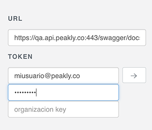

# Explorador API

Al acceder a un Explorador de API primero deberá iniciar sesión con su usuario de Peakly, luego podrá utilizar todas las siguientes solicitudes sin necesidad de autenticarse.

1. TEST - [https://test.api.peakly.co](https://qa.api.peakly.co/swagger)     \[ Sandbox Peakly - No hay conexión con AFIP \]
2. Producción - [https://api.peakly.co](https://qa.api.peakly.co/swagger)

