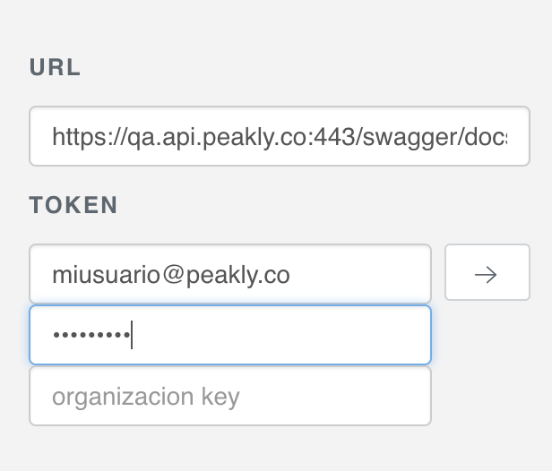

# Explorador API

Al acceder a un Explorador de API primero deberá iniciar sesión con su usuario de Peakly, luego podrá utilizar todas las siguientes solicitudes sin necesidad de autenticarse.

1. QA - [https://qa.api.peakly.co](https://qa.api.peakly.co/swagger)           \[ AFIP Homologación - Test Peakly\]
2. TEST - [https://test.api.peakly.co](https://qa.api.peakly.co/swagger)     \[ AFIP Homologación - Sandbox Peakly \]
3. Producción - [https://api.peakly.co](https://qa.api.peakly.co/swagger)

